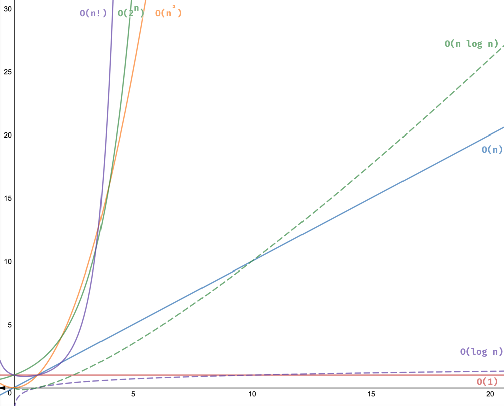

# Algorithm Analysis and Big O

## What is algorithm analysis?
Algorithm analysis is the process of finding the complexity of algorithms. It generally considers two things: time complexity and space complexity.
Time complexity is about the how much time that we need for executing the algorithm by changing the number of inputs. Space complexity is about how much storage that we need for doing the same thing.
An algorithm is said to be effecient if these values are small or the growth is small when the input is getting bigger. Sometimes different
inputs of the same length may cause the algorithm have different behaviour so we try to specify best, worst and average case. If it's not specified we use the worst case.

## Why do we need algorithm analysis?
Knowing the efficiency of an algorithm is an import thing. Generally there are multiple approaches for the same problem, by using algorithm analysis we can choose the optimum approach for the problem. 
Moreover, let's say we wrote an algorithm if we want to improve or optimize the algorithm firstly we should find the efficiency of it. That's why we should learn how to analyze an algorithm.

## How do we analyze algorithms?
Here we come to asymptotic analysis. In asymptotic analysis we try to calculate	the performance of an algorithm in terms of input size. We try to calculate how much time or storage will be taken by the algorithm while input size is getting bigger.
Now we can try to understand the analyzing processes by doing examples.

### Examples
Let's try to write an algorithm and analyze it.

The problem : Write an algorithm to find the sum of n numbers (0 - n).

```
1. BEGIN                          --> It's not considered
2. NUMBER SUM = 0, N              --> 1 ms
3. INPUT N                        --> 1 ms
4. FOR COUNT = 0 < N STEP 1       --> 1 ms
	 SUM = SUM + COUNT            --> N ms
5. OUTPUT SUM                     --> 1ms
6. END                            --> It's not considered   +
                                  -----------------------------
                                  T = N + 4ms							  
```
If we enter 100 to N the T will be 104 ms 

If we enter 1000 to N the T will be 1004 ms   

If we enter 10000 to N the T will be 10004 ms 

You see there is a linear growth. It's depend on just N 

This growth exacts with **O(n) linear growth**.

Now let's try the optimize the algorithm for the same problem.

```
1. BEGIN                          --> It's not considered
2. NUMBER SUM = 0, N              --> 1 ms
3. INPUT N                        --> 1 ms
4. SUM = (N * (N + 1)) / 2        --> 1 ms
5. OUTPUT SUM                     --> 1 ms
6. END                            --> It's not considered  +
                                  ----------------------------
                                  T = 4 ms
```
In this solution we used a mathematic formula to optimize the algorithm. The fourth line calculates the sum of n numbers without looping.

It doesn't matter even if we enter 100, 1000 or 10000 to N the algorithm will be run always at same speed. It's constant.

This time it matches with **O(1) constant**

## Big O Notation
Big O notation is the mathematical way to express worst case of an algorithm. It shows that the growth rate of an algorithm in worst case. That means how much time or storage can be taken by an algorithm in the worst case.

### How to calculate Big O?
I have written `T = N + 4ms` and `T = 4ms` above. We can calculate the Big O from these equations.

1. First we should find the fastest growing variable term.
2. Eliminate the co-efficients/constant terms.

If we wrote something like `2N + 5` in here `2` is co-efficient and `5` is constant so this equation's Big O is **O(n) linear**

Now let's try on our equations.

`T = N + 4`

The variable is `N` and the constant is `4`. There is no co-efficient so this equation's Big O is **O(n) linear**

`T = 4`

There is no variable, no co-efficent. There is  just constant in this case the Big O is **O(1) constant**


As you can see above we calculate **O(n) linear growth** and **O(1) constant** now make a list with all types  and show them with a graphic.

### Big O Notations List
**1. Constant - O(1)**

**2. Logarithmic - O(logn)**

**3. Linear - O(n)**

**4. Linearithmic - O(nlogn)**

**5. Quadratic - O(n^2)**

**6. Cubic - O(n^3)**

**7. Exponential - O(2^n)**

**8. Factorial - O(n!)**



### References
For the chart image https://adrianmejia.com/


