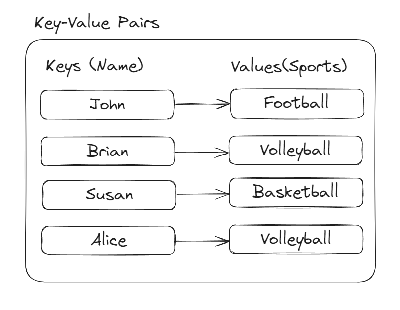

# Hash Table

## What is a hash table?

A hash table is a data structure that maps keys to values for effecient lookup, insertion and deletion. It uses a hashing function to compute an index in to array of buckets or slots, from which the desired value can be found.

### Key-Value Pairs

Key-value pairs can be represented as shown in the image below. While values can repeat, keys must always be unique.

### Main Concepts of Hash Table
- **Hash Function**: Converts a key into hash code, determining the index where the value is stored.
- **Buckets**: The storage slots for key-value pairs.
- **Collisions**: Occur when multiple keys are hashed to the same index.

## How does a hash table work?

1. **Insert**: The key is passed through a hash function to determine the index in the array where the value will be stored.
2. **Search**: The key is hashed to locate the index, and the value is retrieved from that index.
3. **Delete**: The key is hashed to locate the index, and the value is removed from that index.

## What are hash collisions and how are they handled?

Hash collisions occur when two keys produce the same hash code. Hash tables handle collisions using methods like:
- **Chaining**: Store multiple elements in a bucket as a linked list.
- **Open Addressing**: Find the next available slot within the array using methods like:
  - **Linear Probing**
  - **Quadratic Probing**
  - **Double Hashing**

## Applications of hash tables

- **Dictionaries**: Used to store key-value pairs for quick lookup.
- **Database Indexing**: Effecient indexing for database records.
- **Caches**: Storing frequently accessed data for quick retrieval.
- **Symbol Table in Compilers**: Used to store variable names and their associated values.
- **Routing Tables**: Network routers use hash tables for quick routing lookups.

## Types of hash tables

- **Hash Map**: Unordered collection with no guarentees on the order keys.
- **Hash Set**: Specialized hash table for storing unique keys without values.
- **Perfect Hashing**: A collision-free hash table designed for static datasets.

## Complexity

| Operation | Average | Worst | 
| --------- | ------- | ----- | 
| Insert    | O(1)    |  O(n) | 
| Delete    | O(1)    |  O(n) | 
| Search    | O(1)    |  O(n) | 
