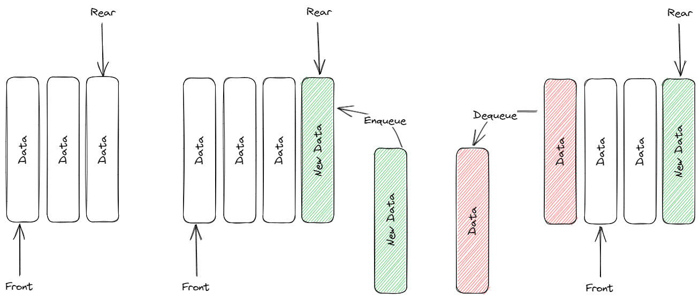

# Queue

## What is a queue?
Queue is a data structure that stores the data in linear way. This data structure refers to real life queue. The new element comes to the end of the queue and the first element is removed when we try to remove an element. You can see the diagram below. The strucuture uses the FIFO(first in first out) behaviour. 
There are two main functions `enqueue()` and `dequeue()`.  

`enqueue()` adds a new element to the end of the queue.

`dequeue()` removes the first element from the queue and return it.

# Priority Queue

## What is a priority queue?
It is basically a queue with elements that has priorities. Unlike queue, priority queue doesn't work with FIFO behaviour. It consider the priority of the element when a new elements is enqueued then it reorders the queue according to the priorities.

## What are some common uses of the queue?
A common example for the queue use case can be a real life waiting line like for a cinema or a theatre system. Also it can be used in web server where first comes first serve kind of systems. Queue is also used by printers to print papers in order. Another example can be messaging apps they store the messages until they can be delivered to the recipent.

## Complexities 

| Operation|  Complexity  | 
| -------- | ------------ | 
| Enqueue  | O(1)         | 
| Dequeue  | O(1)         | 
| Peek     | O(1)         | 
| Removal  | O(n)         | 
| Is Empty | O(1)         | 

