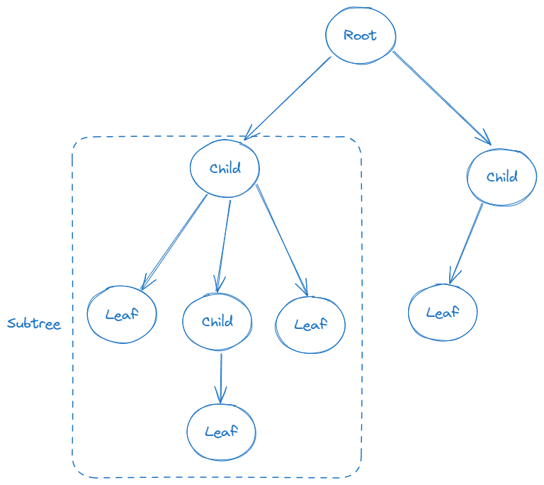
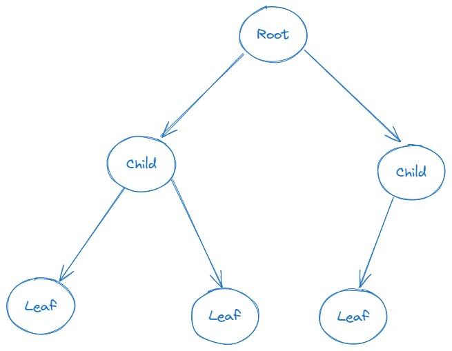

# Binary Search Tree

## What is a tree?
Tree is a data structure that represents datas in hierarchical structure by connecting the nodes with edges. It consists of a root node with child nodes, forming parent-child relationship.
In technical terms, a tree is an acyclic connected graph. For a connected, undirected tree with N nodes, it will have exactly N - 1 edges.

As you can see from the diagram there is a root node, child nodes and leaf nodes. I indicated also a subtree within a rectangle. Also it is represented as a triangle in other diagrams. Even though in the diagram it shows multiple nodes in subtree it is also possible that a subtree can be just a single node.

## What is a binary tree?
A binary tree is a tree where each node has at most two child nodes, typically referred to as the left child and the right child.

## What is a binary search tree?
A binary search tree is a binary tree where the left child of each node contains values less than the node, and the right child contains values greater than the node, enabling efficient search and retrieval operations.

## When and where binary trees used?
- **Binary Search Trees (BST)**: Used for efficient searching, insertion, and deletion operations in databases and dictionaries. Some notable variations of BSTs are:
    - Red Black Trees
    - AVL Trees
    - Splay Trees
- **Syntax Trees**: Utilized in compilers and parsing processes to represent the syntactic structure of programming languages.
- **Expression Trees**: Employed in compilers to represent mathematical expressions for parsing and evaluation.
- **File Systems**: Used in file systems to represent hierarchical directory structures.

## Complexity
| Operation | Average   | Worst | 
| --------- | --------- | ----- | 
| Insert    | O(log(n)) |  O(n) | 
| Delete    | O(log(n)) |  O(n) | 
| Remove    | O(log(n)) |  O(n) | 
| Search    | O(log(n)) |  O(n) | 